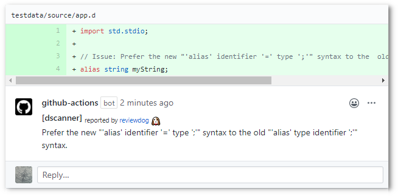

# action-dscanner

[](https://github.com/dgellow/action-dscanner/actions?query=workflow%3ATest)
[](https://github.com/dgellow/action-dscanner/actions?query=workflow%3Areviewdog)
[](https://github.com/dgellow/action-dscanner/actions?query=workflow%3Adepup)
[](https://github.com/dgellow/action-dscanner/actions?query=workflow%3Arelease)
[](https://github.com/dgellow/action-dscanner/releases)
[](https://github.com/haya14busa/action-bumpr)

This [Github Action](https://help.github.com/en/actions) runs [D-Scanner](https://github.com/dlang-community/D-Scanner) on your project and report its result in your Pull Requests via [reviewdog](https://github.com/reviewdog/reviewdog).

D-Scanner is run via a call to `dub lint`, thus a [DUB](https://dub.pm/) project is expected.

<p align="center">
  
</p>

## Input

```yaml
inputs:
  github_token:
    description: 'GITHUB_TOKEN'
    default: '${{ github.token }}'

  ### Flags for reviewdog ###
  level:
    description: 'Report level for reviewdog [info,warning,error]'
    default: 'error'
  reporter:
    description: 'Reporter of reviewdog command [github-pr-check,github-pr-review]'
    default: 'github-pr-review'

  ### Flags for D-Scanner ###
  path:
    description: 'Root directory where D-Scanner should be run from'
    default: ''
  flags:
    description: |
      List of arguments to pass to D-Scanner.
      Example: '--config=path/to/dscanner.ini'
    default: ''
  dub_flags:
    description: |
      List of arguments to pass to dub.
      Example: '--config=path/to/dub.json'
    default: ''
```

## Usage

```yaml
name: reviewdog
on: [pull_request]
jobs:
  linter_name:
    name: runner / dscanner
    runs-on: ubuntu-latest
    steps:
      - uses: actions/checkout@v2
      - uses: dgellow/action-dscanner@v1
        with:
          github_token: ${{ secrets.github_token }}

          # reviewdog config
          reporter: github-pr-review
          level: warning

          # D-Scanner config
          path: 'path/to/my/dub/project'
```
